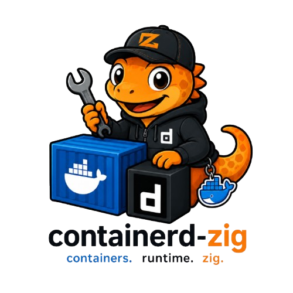

# container-zig

<p align="center">
  
</p>

[English](README.md)

`container-zig` 是一个非官方 Zig SDK，用于调用 Docker Engine API。

`zig-0.17` 分支面向 Zig `0.17.0-dev.1387+01b60634c`，公开导入模块名为 `container_zig`，并把 Docker Engine API v1.55 端点映射为明确的 Zig 模块函数。

## 状态

- Docker Engine API 目标版本：v1.55。
- 可协商 API 区间：v1.40 至 v1.55。
- 已实现端点覆盖：108 / 108。
- 传输支持：Unix socket、TCP、TLS、Windows named pipe、SSH 和自定义 adapter。
- 默认 socket 路径：`/var/run/docker.sock`。
- HTTP、TLS、socket、进程和 WebSocket framing 均使用 Zig `0.17` 标准库。SSH 传输直接执行用户的 `ssh`，不会经过 shell。

本项目不是 Docker 官方 SDK。Docker 官方文档当前列出的官方 SDK 是 Go 和 Python，也支持直接使用 Engine API。

## 要求

- Zig `0.17.0-dev.1387+01b60634c`。
- 可以通过任一受支持传输访问的 Docker Engine。
- Docker daemon API 版本需要支持你调用的端点。

调用较新的 Docker API 端点前，建议先运行 `docker version` 查看 daemon 支持的 API 版本。

`main` 分支在 Zig `0.16.0` 上保持等价的 SDK 行为；`zig-0.15` 分支面向 Zig `0.15.2`。

## 版本支持

项目只主动维护 `main` 所选 Zig 发行版本及其前后各一个版本。新的 Zig 版本发布后，超出这三个版本范围的旧分支仍会保留，供现有用户继续使用，但不再提供错误修复、安全修复或兼容性维护。

## 设计

`Client.init(allocator, io, config)` 返回 error union，并校验选中的传输。所有带版本的端点调用前必须执行 `try client.connect()`。自动版本和固定版本都会校验 daemon 支持的 API 区间。

构建上下文、镜像归档和容器归档统一使用 `docker.Client.Upload`，支持内存字节和增量 reader。镜像 pull、push、build、load 返回 `docker.image.ProgressStream`；即使 HTTP 状态为 200，也必须逐项检查 daemon 的后置错误。Attach 和 Exec start 返回 `docker.stream.Session`，TTY 使用原始字节，非 TTY 使用 stdout／stderr multiplex frame。

## 安装

在另一个 Zig 项目中添加依赖：

```sh
zig fetch --save=container_zig git+https://github.com/GuangYiL/container-zig#v1.0.0
```

然后在使用方项目的 `build.zig` 中接入模块：

```zig
const container_zig = b.dependency("container_zig", .{
    .target = target,
    .optimize = optimize,
});

exe.root_module.addImport("container_zig", container_zig.module("container_zig"));
```

## 快速开始

```zig
const std = @import("std");
const docker = @import("container_zig");

pub fn main(init: std.process.Init) !void {
    var client = try docker.Client.init(init.gpa, init.io, .{});
    defer client.deinit();

    try client.connect();

    var ping = try docker.system.ping(init.gpa, &client);
    defer ping.deinit();

    var version = try docker.system.version(init.gpa, &client);
    defer version.deinit();

    std.log.info("Docker {s}, API {s}", .{
        version.engine_version,
        ping.api_version,
    });
}
```

`Client.connect` 会请求 `/version`，计算 daemon 与 SDK 支持区间的交集，并保存最终版本。普通端点不会使用无版本路径。

可以自动发现 socket 并运行项目示例，也可以显式传入自定义 socket 路径：

```sh
zig build run
zig build run -- "unix://$HOME/.orbstack/run/docker.sock"
zig build run -- "tcp://127.0.0.1:2375"
zig build run -- "https://docker.example.com:2376"
zig build run -- "ssh://builder@docker.example.com"
```

未传参数时，示例程序会先检查 `DOCKER_HOST`。在 Unix 上，再依次发现 `/var/run/docker.sock`、
`$HOME/.orbstack/run/docker.sock` 和 `$HOME/.docker/run/docker.sock` 中真实存在的 Unix socket。
显式配置的路径无效时会立即失败，不会被自动发现结果静默替换。

## Transport

```zig
var client = try docker.Client.init(init.gpa, init.io, .{
    .transport = .{
        .unix_socket = .{
            .path = "/path/to/docker.sock",
        },
    },
});
defer client.deinit();
try client.connect();
```

同一个显式 `Transport` union 还可选择 `.tcp`、`.tls`、`.named_pipe` 或 `.ssh`。默认拒绝远程明文 TCP，只接受 loopback；只有明确设置 `allow_insecure_remote = true` 才会开放。TLS 使用 Zig 标准证书 bundle 校验 daemon 证书。Windows 默认 named pipe 是 `\\.\pipe\docker_engine`。SSH 在远端执行 `docker system dial-stdio`，支持 user、port、identity file 和显式 extra arguments。`.custom` 接收调用方提供的双工 connector。

## 固定 API 版本

兼容性测试需要精确版本时，可以固定 API 版本：

```zig
var client = try docker.Client.init(init.gpa, init.io, .{
    .api_version = .{ .fixed = .{ .major = 1, .minor = 55 } },
});
defer client.deinit();
try client.connect();
```

如果 daemon 支持区间不包含该版本，`connect` 会直接失败，不会静默降级。

## API 形态

公开 API 采用模块函数风格：

```zig
const docker = @import("container_zig");

const filters = try docker.params.filters(allocator, &.{
    .{ .name = "status", .values = &.{"running"} },
});
defer allocator.free(filters);

var containers = try docker.container.list(allocator, &client, .{
    .all = true,
    .filters = filters,
});
defer containers.deinit();

for (containers.items) |container| {
    if (container.id) |id| {
        std.log.info("container {s}", .{id});
    }
}
```

单次端点调用参数使用资源模块下的直接类型，例如 `docker.container.ListOptions` 和
`docker.image.BuildOptions`。长期对象配置仍归属于持有该配置的对象，例如 `docker.Client.Config`。
这样既便于发现端点参数，也避免为了命名空间而引入 `Build.Config` 这类空壳 wrapper。

常用模块：

| 模块 | 示例 |
| --- | --- |
| `docker.system` | `ping`, `pingText`, `version`, `info`, `events`, `dataUsage`, `auth` |
| `docker.container` | `create`, `list`, `inspect`, `logs`, `attach`, `start`, `stop`, `remove`, `prune` |
| `docker.image` | `list`, `build`, `create`, `inspect`, `attestations`, `push`, `tag`, `remove`, `search`, `load` |
| `docker.volume` | `list`, `create`, `inspect`, `update`, `remove`, `prune` |
| `docker.network` | `list`, `create`, `inspect`, `connect`, `disconnect`, `remove`, `prune` |
| `docker.swarm` | `inspect`, `init`, `join`, `leave`, `update`, `unlockKey`, `unlock` |
| `docker.service` | `list`, `create`, `inspect`, `update`, `logs`, `remove` |
| `docker.exec` | `create`, `start`, `resize`, `inspect` |

有限响应模型拥有返回内存，并提供 `deinit`。流式端点返回明确的 stream wrapper，也需要调用 `deinit`。`docker.stream.RecordDecoder` 支持 NDJSON 和 RFC 7464 JSON Sequence；`docker.stream.MultiplexDecoder` 保留二进制 stdout／stderr frame。

镜像 attestations 返回有限的 owned list，platform filter 使用带类型的 OCI platform 模型：

```zig
var attestations = try docker.image.attestations(allocator, &client, "example/app:latest", .{
    .platforms = &.{.{ .os = "linux", .architecture = "amd64" }},
    .statement = true,
});
defer attestations.deinit();
```

`docker.params.filters` 用于生成 Docker filter 查询 JSON，`docker.params.stringMap` 用于生成 build args、labels 这类 JSON object 参数。两个 helper 都返回 allocator-owned JSON bytes。

## 流式与交互 I/O

上传内容不需要整体缓存在内存中：

```zig
var tar_reader = std.Io.Reader.fixed(tar_bytes);
var progress = try docker.image.build(allocator, &client, .{
    .context = .{ .stream = .{
        .reader = &tar_reader,
        .content_length = tar_bytes.len,
    } },
});
defer progress.deinit();

while (try progress.next(allocator)) |item_value| {
    var item = item_value;
    defer item.deinit();
    switch (item) {
        .progress => |message| std.log.info("{?s}", .{message.status}),
        .daemon_error => |_| return error.DaemonStreamError,
    }
}
```

`docker.exec.start` 和 `docker.container.attach` 返回 `docker.stream.Session`。非 TTY 会话使用 `nextFrame`，TTY 会话直接使用 `reader` 读取原始字节；`writer` 和 `closeStdin` 提供双工输入。Logs 使用同一套 Docker 8-byte multiplex decoder。Events 和 stats 能跨任意网络 buffer 边界增量解码。

非成功响应会通过 `Client.Config.api_error_handler` 提供结构化 `ApiFailure`，其中包含 method、endpoint、status、daemon message 和协商后的版本。遇到 typed SDK 尚未覆盖的新端点时，`Client.request` 仍是 raw escape hatch。

默认不重试。只有显式配置 `retry_policy` 后，才会对无 body 的 GET／HEAD 临时连接错误执行重试；修改状态的请求和 HTTP status failure 永远不会自动重试。

## 内存所有权

- 公开的有限响应结果拥有返回内存，并提供 `deinit`。
- 需要释放嵌套 owned 数据的公开结果 wrapper 会保存 allocator。
- `Client.init` 显式接收 allocator 和 `std.Io`；会分配内存的端点函数把 allocator 放在首位。
- 方法始终把 receiver 放在首位，包括同时接收 allocator 的方法。
- 内部嵌套模型释放保持 Zig 方法形态：`value.deinit(allocator)`。
- 大型只读响应如果整体一起释放，可以使用内部 arena 持有返回字段。

## Transport 说明

- TLS 使用 Zig 标准 trust store 并校验服务端证书。目标标准 HTTP client 尚未公开 mTLS client identity 注入，因此客户端证书场景通过 custom transport 接入。
- Named pipe 仅在 Windows 上可用。
- SSH transport 要求本机存在 `ssh`，远端 Docker CLI 支持 `docker system dial-stdio`。
- `zig-0.17` 分支使用 Zig `0.17.0-dev.1387+01b60634c` 验证，不包含 Zig 0.16 兼容 shim。

## 许可证

`container-zig` 使用与 Zig 完全相同的 MIT License (Expat) 许可证文本。见 [LICENSE](LICENSE)。

## 参考

- [Docker Engine API](https://docs.docker.com/reference/api/engine/)
- [Docker Engine API v1.55 reference](https://docs.docker.com/reference/api/engine/version/v1.55/)
- [Docker Engine API version history](https://docs.docker.com/reference/api/engine/version-history/)
- [Zig 开发版文档](https://ziglang.org/documentation/master/)
